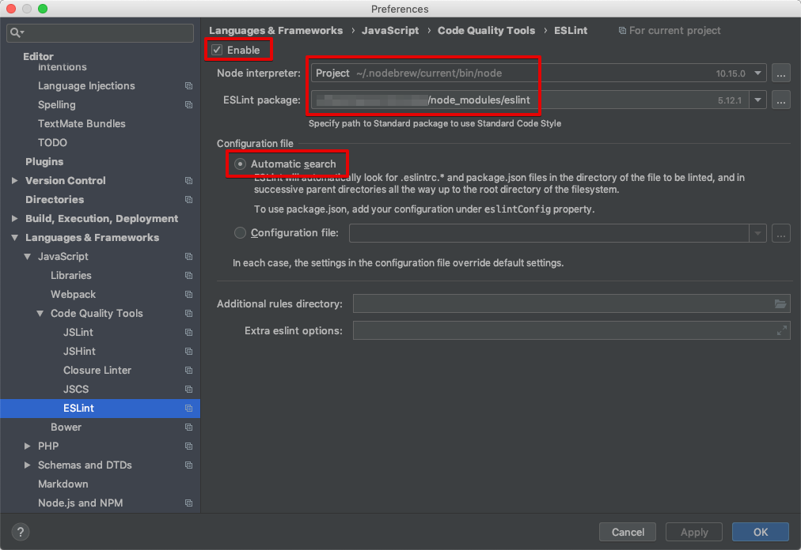
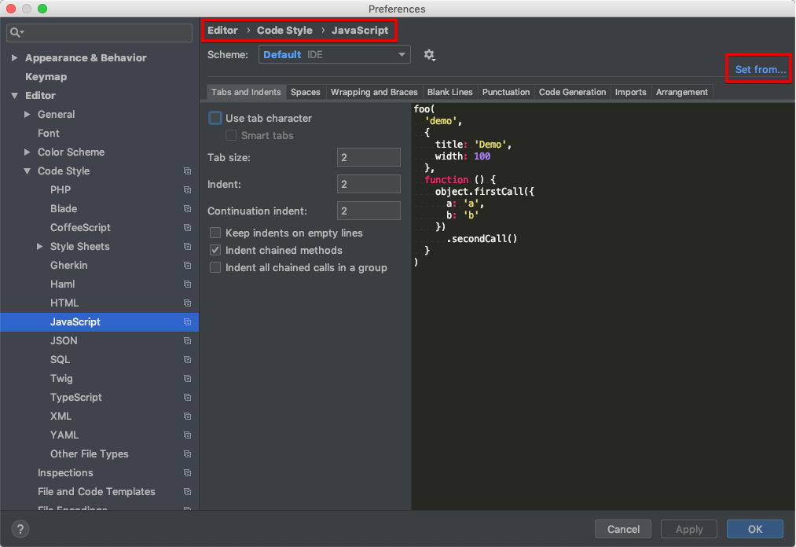

# ビルドしてみる

Node.js は、パッケージ管理に npm というパッケージマネージャーを用います。

> Facebook 製の yarn というパッケージマネージャーもあります。
> npm のできの悪さに業を煮やした Facebook が代替を作った、という経緯がありますが、最近は npm も改善されています。

## package.json の作成

npm コマンドで作成するか、PHPStorm の新規ファイル作成で package.json を選択してください。

```bash
npm init
```

## package のインストール

### ESLint のインストール

```bash
npm install --save-dev eslint eslint-config-standard eslint-plugin-import eslint-plugin-node eslint-plugin-promise eslint-plugin-standard
```

### Babel、webpack のインストール

```bash
npm install --save-dev @babel/core @babel/preset-env webpack babel-loader
```

## ESLint の設定

プロジェクトフォルダに `.eslintrc` を作成、以下の内容を記述

```json
{
  "extends": "standard",
  "plugins": [
    "standard"
  ]
}
```

PHPStorm で ESLint を有効化します。



PHPStorm の Editor のフォーマットも修正しておきます。



## ESLint が効いているか確認する

以下のファイルを作成して、簡単な ES2015 コードを書いてみて、ESLint が効いているかどうかをチェックします。

`src/index.js`

```javascript
const conf = require('./config')

console.log(conf.name)
```

`src/config.js`

```javascript
module.exports = {
  name: 'GitHub'
}
```

セミコロンをつけるとエラーになります。
また、package.json に

```json
  "scripts": {
    "lint": "eslint src"
  },
```

を追加すると、CLI で `npm run lint` のように実行できます。

> 以下のように直接実行しても OK です。
> - Win: `node_modules\.bin\eslint src`
> - Mac: `./node_modules/.bin/eslint src`

## Babel、webpack の設定

以下の内容で `.babelrc` を作成します。

```json
{
  "presets": [
    "@babel/preset-env"
  ]
}
```

以下の内容で `webpack.config.js` を作成します。

```javascript
module.exports = {
  module: {
    rules: [
      {
        test: /\.js$/,
        loader: 'babel-loader'
      }
    ]
  }
}
```

`package.json` の `scripts` に以下を追記します。

```json
    "build:dev": "webpack --mode development",
    "build:prod": "webpack --mode production"
```

## ビルドしてみる

package.json の `build:dev` の行で run するか、CLI で `npm run build:dev` してみます。

`dist/main.js` が生成されれば成功です。

