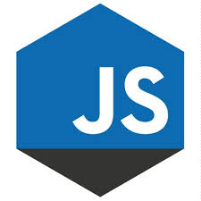

# JavaScript の歴史

JavaScript は、1995年に NetScape Communications 社が自社のブラウザ NetScape Navigator に搭載したプログラミング言語です。
その後、Microsoft が Internet Explorer に搭載すると、その利便性から急速に普及していきました。

ただし、Microsoft が実装したのは JScript という類似の仕様のものであり、ブラウザ戦争が過熱するに従って独自に機能拡張が行われるようになったことで互換性に問題が出てきました。
そこで、情報通信システムの分野における国際的な標準化団体である ECMA International のもとで ECMAScript (ES) として標準化が行われました。

ES3 が定義された2000年代になると、ブラウザ毎の差異も少なくなり活用範囲が広がりました。
2005年に Google Maps が登場し Ajax が注目されると一気にその有用性が認知され、今日に至るまで様々なサービスに活用されるようになりました。

現在は ES5.1 がベースとなっていますが、一部のブラウザではその先の ES6(2015)、ES2016、ES2017 も実装されています。

## Node.jsの登場

JavaScript が注目されてくると、それをサーバサイドでも利用したい、と考える人達が出てきました。

Google が中心となって開発を進めている Google Chrome に搭載されている V8 JavaScript Engine をベースに2009年にサーバサイド言語として生まれたのが、Node.js です。

後発のサーバサイド開発言語として、もともとは「フロントエンドと同じ JS が使える」「C10K 問題にも対応できる」等のメリットが注目され普及しましたが、標準・サードパーティライブラリが充実していることや、多くのシステムが JSON をデータ交換フォーマットとして使用しており親和性が高いことなどから、汎用スクリプティング環境としてサーバのみならず開発用PCでも各種開発ツールのベースとして利用される様になっています。
