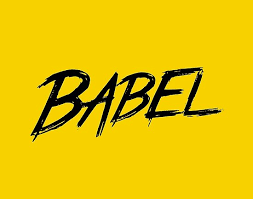
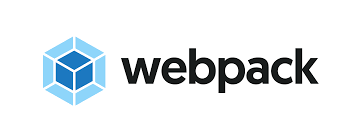

# フロントエンド開発ツール

昨今ではインターネットのサービスの中で Web ブラウザの重要性が増しており、Web アプリケーションとして高機能なものが要求されるようになってきています。

Web アプリケーションにおいてデータの取り回しや UI 的な動作を司るのは JavaScript の役割ですが、アプリケーションが大規模になるに連れて、従来の JS(ES5) による開発では解決が難しい様々な課題が出てきました。

最近の「モダンな Web アプリケーション開発」と呼ばれるものは、以下のようなツールがベースになっています。

- Babel: JavaScript compiler
- webpack: Static module bundler

これらのツールにプラスして、React や Angular、Vue 等のフロントエンドフレームワークを用いた開発が人気ではありますが、
フレームワークを用いないケースでも、Babel + webpack に移行するだけで生産性は大きく向上するでしょう。

## Babel

[Babel](https://babeljs.io/) は、ES2015 以降のモダン JS から、ブラウザ互換の JS（≒ ES5）への言語変換（transpile）および polyfill をするツールです。
このツールを使うことで、ブラウザがサポートしている JS のバージョンが低くても、開発自体は最新仕様の JS を用いることが可能になります。

単体で使用するというよりは、後述の webpack と併用することが一般的です。

## webpack

[webpack](https://webpack.js.org/) は、`require` や `import` を用いてモジュール開発している JS を1つにまとめるためのツールです。
JS をまとめる以外にも CSS や画像まで JS に埋め込んでしまえるなど、高度な機能を持っています。

Web ブラウザで使える JS は、`require` のようなモジュールロードの機能がないため、1ファイルに纏めて利用できるようにします。
また HTTP1.1 ではファイル数が多いと通信のオーバーヘッドがかかるため、纏めることで高速化するメリットもあります。

このツールを使うことで、Node.js に用意されている豊富なパッケージをブラウザで利用できるようになります。

実際には、webpack でモジュールをバンドルする際に Babel をかける形で連携させます。

## Lebab

[Lebab](https://github.com/lebab/lebab) は、ES5 コードを ES2015/ES2016 に逆変換するためのツールです。

> Babel を逆さまに読むと Lebab になります。

既存の ES5 で書かれたコードを ES2015/ES2016 にリライトする際に役立ちます。
